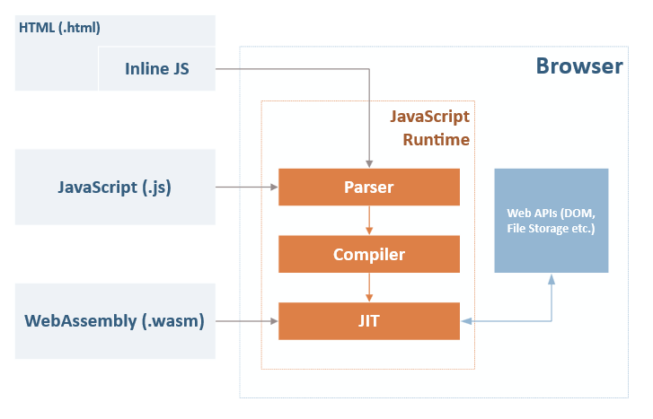
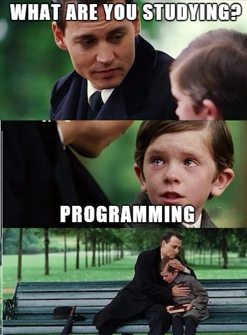

class: left, bottom, slide-main
background-image: url(./images/main.png)

# My first experiences with WebAssembly

Jan Bevers

---

# Agenda

1. What is WebAssembly?
2. How WebAssembly works compared to JavaScript
3. My first lines of code
4. Performance Benchmarks
5. Ecosystem
6. Discussions / questions

---

# What is WebAssembly?

1. An improvement to JavaScript
2. A new language
3. A browser improvement: Browsers will understand the binary format
4. A compile target

<iframe src="https://giphy.com/embed/46RrPTYlYIemQ" width="240" height="180" frameBorder="0" class="giphy-embed" allowFullScreen></iframe>

---

# What is WebAssembly?

<strong>We need WebAssembly</strong> because as flexible as JavaScript is, it’s still too hard to express many of the things we may want to in JavaScript, and the features we’d need to make it easy might add complexity to a language that already confuses many users.

WebAssembly gives us <strong>access to a set of low level building blocks</strong> that we can use to construct just about anything you can imagine.

The most obvious use cases are <strong>Games, VR and augmented reality</strong>. Most of the current WebAssembly demos use Unity or Unreal Engine, both of which already support compiling to asm.js.

<iframe src="https://giphy.com/embed/OrB0Ruvuy7kIw" width="240" height="160" frameBorder="0" class="giphy-embed" allowFullScreen></iframe>

---

# How WebAssembly works compared to JavaScript

**Parser** - Performs lexical analysis on the JavaScript code and converts it into tokens (small strings with specific meaning). The tokens are then reassembled into a syntax tree that gets used in the next step.
  
**Compiler** - Transforms the syntax tree into bytecode, which is a low-level representation of the code that the interpreter can quickly understand and evaluate.
  
**JIT** - A just-in-time interpreter that takes the bytecode and evaluates it on the fly at runtime, thus executing your code.

---

# How WebAssembly works compared to JavaScript

---

# How WebAssembly works compared to JavaScript

---

# How WebAssembly works compared to JavaScript

Each browser has its own engine:

1. Chrome has V8
2. Safari has JavaScriptCore (JSC)
3. Edge has Chakra
4. Firefox has SpiderMonkey

---

#  My first lines of code

---

# Performance benchmarks

“Wasm is about 30% faster than asm.js / JavaScript”. On desktop chrome, this is mostly true!

Mobile Chrome is about 60% faster, mobile and desktop Firefox is insanely faster by about 90%, mobile and desktop Safari is only bit faster by about 20%.

[More info](https://medium.com/@torch2424/webassembly-is-fast-a-real-world-benchmark-of-webassembly-vs-es6-d85a23f8e193)

---

# Ecosystem

1. Languages: **Go, Kotlin, OCAML, Python, Rust, AssemblyScript, ...**
2. Frameworks: 
    1. **asm-dom** - A minimal WebAssembly virtual DOM to build C++ SPA
    2. **Blazor** - Microsoft's web UI framework using C#/Razor and HTML, running client-side via WebAssembly
    3. **Yew** - Rust framework for making client web apps

---

# Ecosystem

[Extended list](https://github.com/mbasso/awesome-wasm)

---

# Discussions / Questions

Still awake?

<iframe src="https://giphy.com/embed/eBCnpuRGBhQGY" width="480" height="409" frameBorder="0" class="giphy-embed" allowFullScreen></iframe>

---

# Source articles

1. [What is WebAssembly?](https://medium.com/javascript-scene/what-is-webassembly-the-dawn-of-a-new-era-61256ec5a8f6)
2. [Blazor, Razor, WebAssembly, and Mono](https://daveaglick.com/posts/blazor-razor-webassembly-and-mono)
3. [Calls between JavaScript and WebAssembly are finally fast 🎉](https://hacks.mozilla.org/2018/10/calls-between-javascript-and-webassembly-are-finally-fast-%F0%9F%8E%89/)
